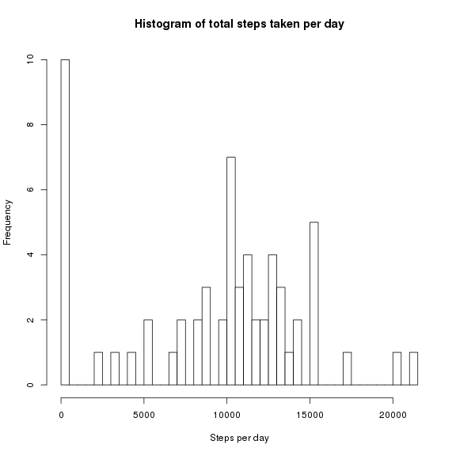
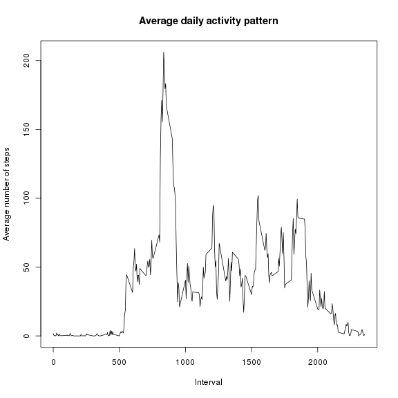
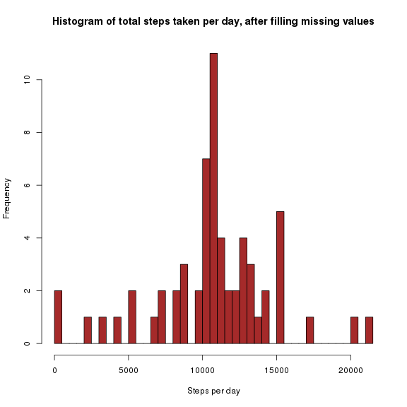
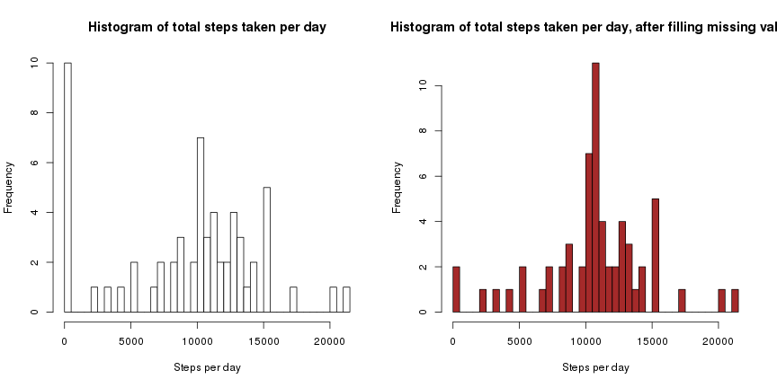
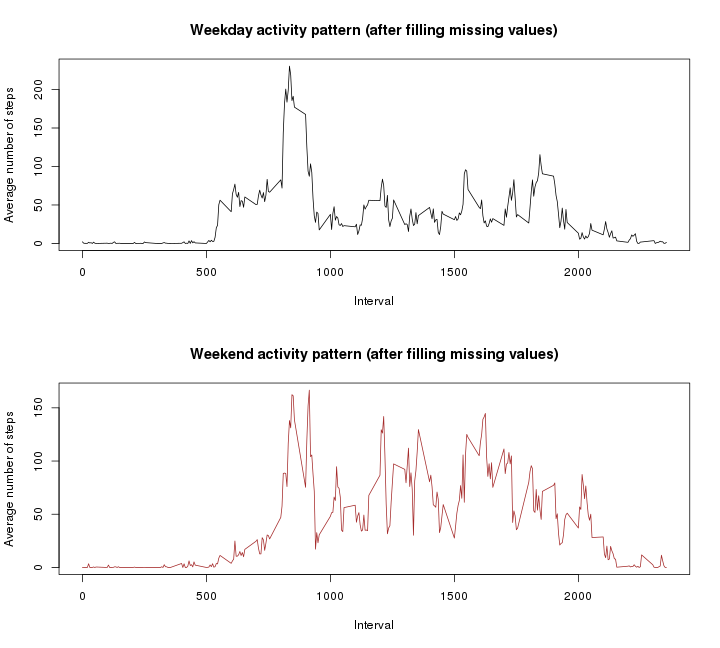

## Introduction
This is the solution for peer assignment 1 in "Reproducible research"
course.

## Loading and processing the data

```r
activity <- read.csv('activity.csv', na.strings="NA")
head(activity)
```

```
##   steps       date interval
## 1    NA 2012-10-01        0
## 2    NA 2012-10-01        5
## 3    NA 2012-10-01       10
## 4    NA 2012-10-01       15
## 5    NA 2012-10-01       20
## 6    NA 2012-10-01       25
```

## Mean and total number of steps taken per day
Total number of steps taken per day is in stepday column of the stpd data frame:

```r
library(dplyr)
gr = group_by(activity, date)
stpd = summarise(gr, stepday = sum(steps, na.rm=TRUE))
# stpd
```

The following is the histogram of steps taken per day:

```r
hist(stpd$stepday, main="Histogram of total steps taken per day",
col='white', breaks=nrow(stpd), xlab="Steps per day")
```

 

Mean of steps per day, included 0 values (transformed from
NA values by summarise function):

```r
mean(stpd$stepday, na.rm=TRUE)
```

```
## [1] 9354.23
```
and excluded 0 values:

```r
mean(stpd$stepday[stpd$stepday!=0], na.rm=TRUE)
```

```
## [1] 10766.19
```

Median of steps per day, included 0 values (transformed from
NA values by summarise function):

```r
median(stpd$stepday, na.rm=TRUE)
```

```
## [1] 10395
```
and excluded 0 values:

```r
median(stpd$stepday[stpd$stepday!=0], na.rm=TRUE)
```

```
## [1] 10765
```

## Average daily activity pattern
Time series plot (i.e. type = "l") of the 5-minute interval (x-axis)
and the average number of steps taken, averaged across all days (y-axis):

```r
stavg = group_by(activity, interval)
avg = summarise(stavg, average=mean(steps, na.rm=TRUE))
with(avg, plot(average ~ interval, xlab="Interval", col='black',
	ylab="Average number of steps", main="Average daily activity pattern", type="l"))
```

 

Which 5-minute interval, on average across all the days
in the dataset, contains the maximum number of steps?

```r
avg$interval[which.max(avg$average)]
```

```
## [1] 835
```
The interval contains maximum average number of step is ``835``.

## Imputing missing values
Calculate and report the total number of missing values in the dataset:

```r
sum(is.na(activity$steps))
```

```
## [1] 2304
```

*Devise a strategy for filling in all of the missing values in the dataset
and create a new dataset that is equal to the original dataset but
with the missing data filled in:*
The missing values of any interval will be replaced by
mean of non-missing corresponding interval across all days. 

```r
# naindex is the index of NA values in steps column
# of activity data frame
naindex = which(is.na(activity$steps))
activity1 = activity
tmp = sapply(naindex, function(x) {
	missint = activity1$interval[x]
	meanmiss = avg$average[which(avg$interval==missint)]
	activity1$steps[x] <<- floor(meanmiss)
})
remove(tmp)
head(cbind(steps_before=activity$steps, steps_after=activity1$steps,
date=activity$date, interval=activity$interval))
```

```
##      steps_before steps_after date interval
## [1,]           NA           1    1        0
## [2,]           NA           0    1        5
## [3,]           NA           0    1       10
## [4,]           NA           0    1       15
## [5,]           NA           0    1       20
## [6,]           NA           2    1       25
```

```r
head(avg)
```

```
## Source: local data frame [6 x 2]
## 
##   interval   average
## 1        0 1.7169811
## 2        5 0.3396226
## 3       10 0.1320755
## 4       15 0.1509434
## 5       20 0.0754717
## 6       25 2.0943396
```

Make a histogram of the total number of steps taken each day and
calculate and report the mean and median total number of steps taken per day
then calculate mean and median of the new data set. The mean and median are
slight different from those of the original data set.

```r
gr1 = group_by(activity1, date)
stpd1 = summarise(gr1, stepday = sum(steps))
hist(stpd1$stepday, main="Histogram of total steps taken per day, after filling missing values",
col='brown', breaks=nrow(stpd1), xlab="Steps per day")
```

 

```r
mean(stpd1$stepday)
```

```
## [1] 10749.77
```

```r
median(stpd1$stepday)
```

```
## [1] 10641
```


```r
par(mfrow=c(1,2))
hist(stpd$stepday, main="Histogram of total steps taken per day",
col='white', breaks=nrow(stpd), xlab="Steps per day")
hist(stpd1$stepday, main="Histogram of total steps taken per day, after filling missing values",
col='brown', breaks=nrow(stpd1), xlab="Steps per day")
```

 

The histogram of the total number of steps taken each day of the new data set
is slightly different from that of the original one:

1. Frequency of days those have total number of steps close to 0 decreases dramatically.

2. Frequency of days those have total number of steps close to the mean increases.

3. Frequency of other days remains the same.

The above figure depicts this statement.
## Are there differences in activity patterns between weekdays and weekends?
First we create a factor variable with two levels: weekday and weekend.

```r
wd = weekdays(as.Date(activity1$date))
wd[which(wd=='Saturday'|wd=='Sunday')] = 'weekend';
wd[which(wd!='weekend')] = 'weekday'
activity1 = mutate(activity1, dayofweek=wd)
```
Make a panel plot containing a time series plot (i.e. type = "l") of
the 5-minute interval (x-axis) and the average number of steps taken,
averaged across all weekday days or weekend days (y-axis).

```r
stavg1 = group_by(activity1, interval, dayofweek)
avg1 = summarise(stavg1, average=mean(steps))
par(mfrow=c(2,1))
with(filter(avg1, dayofweek=='weekday'), plot(average ~ interval, xlab="Interval",
	col='black', ylab="Average number of steps",
	main="Weekday activity pattern (after filling missing values)", type="l"))
with(filter(avg1, dayofweek=='weekend'), plot(average ~ interval, xlab="Interval",
	col='brown', ylab="Average number of steps",
	main="Weekend activity pattern (after filling missing values)", type="l"))
```

 

Differences of weekdays and weekends activity patterns:

1. Maximum average number of steps per interval of weekdays is over 200 while
that of weekends is less than 200. The maximums are in the interval 800-900.

2. Average number of steps per interval of weekends from interval 1000 to 2000
is generally larger than that of weekdays.

